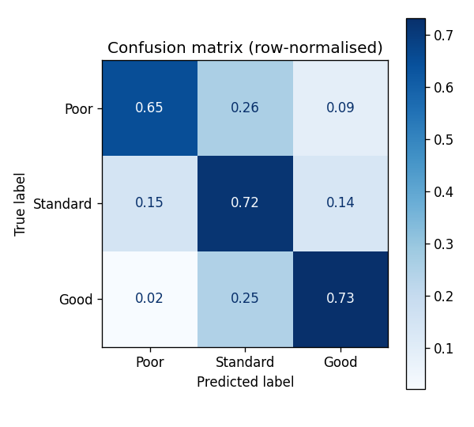
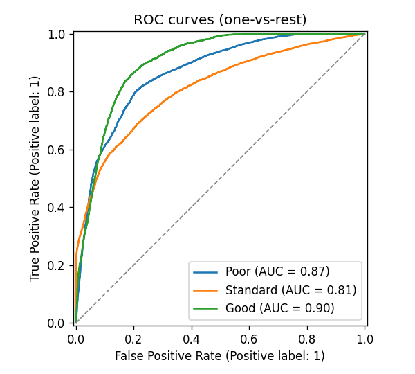
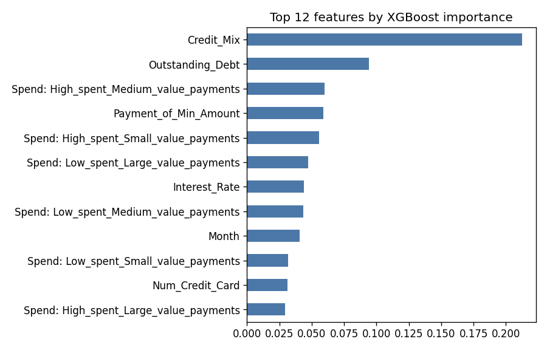

# Credit Score Classification: kNN vs Random Forest vs XGBoost

Predicting a customer's credit-score band (**Poor / Standard / Good**) from monthly financial records:
income, debt, credit utilisation, payment delays, credit history and more. The dataset has about 100,000 rows
from roughly 12,000 customers.

The repo brings together two university projects (a **kNN model in R** and **Random Forest vs XGBoost in
Python**) and a 2026 rebuild of the XGBoost pipeline that fixes a subtle evaluation problem.

**Headline:** the tuned SMOTE + XGBoost pipeline scores **81.5% accuracy / 0.93 ROC-AUC**
on a standard row-level split. On customers the model has **never seen**, it scores **70.0% / 0.86**,
which is the honest number for a new applicant ([why](#the-leakage-lesson)). On unseen customers, SMOTE + tuning
lifts recall on the minority **Good** class from **63.4% to 73.1%**.

## Results: 2026 XGBoost pipeline (`src/train_xgboost.py`)

Test set = 20% of rows. Recall is shown per class as Poor / Standard / Good.

**Customer-level split** (whole customers held out, the realistic setting):

| Model | Accuracy | Macro-F1 | ROC-AUC (macro, OvR) | Recall P / S / G |
|---|---|---|---|---|
| XGBoost baseline (no SMOTE, default params) | 69.9% | 0.671 | 0.858 | 64.1% / 75.1% / 63.4% |
| **SMOTE + XGBoost, tuned (GridSearchCV)** | 70.0% | 0.680 | 0.861 | 65.0% / 71.6% / 73.1% |

**Row-level random split** (same customer can appear in train and test, like most tutorials):

| Model | Accuracy | Macro-F1 | ROC-AUC (macro, OvR) | Recall P / S / G |
|---|---|---|---|---|
| XGBoost baseline (no SMOTE, default params) | 77.1% | 0.758 | 0.908 | 73.3% / 79.9% / 75.3% |
| **SMOTE + XGBoost, tuned (GridSearchCV)** | 81.5% | 0.809 | 0.930 | 81.4% / 82.1% / 80.1% |

Tuning: the same 48-combination grid for both splits, 3-fold CV (`StratifiedGroupKFold` for the
customer-level split), 144 fits each, scored on macro-F1.
- Best on unseen customers: `colsample_bytree=0.8, learning_rate=0.1, max_depth=4, n_estimators=200, subsample=0.8`
- Best on the row-level split: `colsample_bytree=1.0, learning_rate=0.1, max_depth=8, n_estimators=400, subsample=0.8`

When customers can't be memorised, the search prefers shallower trees.

<p>



</p>

## The leakage lesson

Each customer appears up to 8 times (one row per month), and many of their features (income, number of
accounts, interest rate, loans) stay the same from month to month.
With a random row-level split, the model is tested on customers it has already seen. It partly *recognises*
them rather than *predicting* them, and accuracy drops by about **11.6 points** once whole
customers are held out (`GroupShuffleSplit` on `Customer_ID`). The same effect is the likely reason kNN, which
literally looks up the nearest rows, scored highest in the coursework below.

Also fixed in the rebuild: **SMOTE runs inside the cross-validation pipeline** (`imblearn.Pipeline`), so
synthetic rows are created only from training folds. In the original R analysis, SMOTE ran before the
train/test split, so synthetic rows interpolated from test customers end up in the training set.

## Coursework results (row-level split, for reference)

| Model | Who | Test accuracy | Notes |
|---|---|---|---|
| kNN (R, `kknn`, triangular kernel, k = 5) | Annie, group project | 83.2% | SMOTE applied before the split and same-customer leakage, so optimistic |
| XGBoost + SMOTE + GridSearchCV | Annie | 79.5% | 2,187 combinations × 5-fold CV. Tuning lifted accuracy from 74% to 79.5% |
| Random Forest + SMOTE | teammate | 79.3% | Overfits: 100% train accuracy |

## Repo layout

```
data/clean_train.csv            96,696 rows, cleaned by the kNN project team (used by src/ and r-knn/)
data/clean_data.csv             78,937 rows, one-hot encoded version used by the notebook
src/train_xgboost.py            2026 pipeline: split -> one-hot -> SMOTE -> XGBoost, GridSearchCV, metrics + plots
results/                        metrics JSON and plots written by the script
notebooks/xgboost_vs_random_forest.ipynb   coursework notebook (Random Forest vs XGBoost), with outputs
r-knn/                          coursework kNN analysis in R Markdown + plots
```

## Run it

```bash
pip install -r requirements.txt
python src/train_xgboost.py --quick                        # ~3 min sanity run
python src/train_xgboost.py                                # full grid, customer-level split (~45 min on 2 cores)
python src/train_xgboost.py --split random                 # same grid on a row-level split, for comparison
```

R: `install.packages(c("kknn", "dplyr", "ggplot2", "caret", "pROC", "smotefamily", "knitr"))`, then knit `r-knn/Kknn_opt.Rmd`.

## Next steps

- Probability calibration and cost-sensitive thresholds: missing a *Poor* customer costs more than a false alarm.
- SHAP explanations per prediction.
- Customer-level features (trends across months) instead of treating each month independently.

## Data

A cleaned version of the public [Credit score classification](https://www.kaggle.com/datasets/parisrohan/credit-score-classification)
dataset on Kaggle.
